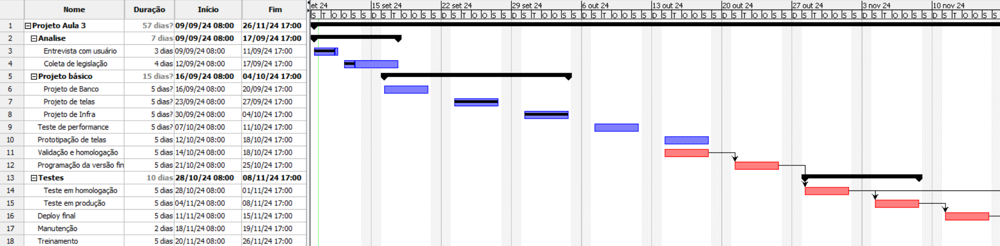
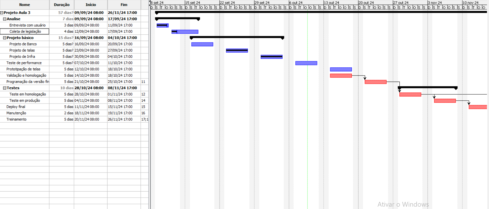

# leonardi_vinicius

## Sistema Para: Desenvolvimento de IA Empática: Técnicas e Impactos nas Interações Humanas

- [leonardi\_vinicius](#leonardi_vinicius)
  - [Sistema Para: Desenvolvimento de IA Empática: Técnicas e Impactos nas Interações Humanas](#sistema-para-desenvolvimento-de-ia-empática-técnicas-e-impactos-nas-interações-humanas)
- [1. Introdução](#1-introdução)
- [2. Objetivos e Metas](#2-objetivos-e-metas)
- [3. Metodologia e desenvolvimento](#3-metodologia-e-desenvolvimento)
- [4. Papeis e responsabilidade](#4-papeis-e-responsabilidade)
- [5. Requisitos](#5-requisitos)
  - [5.1 Funcionais](#51-funcionais)
  - [5.1.2 Não Funcionais](#512-não-funcionais)
- [6. Arquitetura e módulos](#6-arquitetura-e-módulos)
- [7. Plano de desenvolvimento](#7-plano-de-desenvolvimento)
  - [7.1. Lista de recursos](#71-lista-de-recursos)
- [8. Orçamento e cronograma geral](#8-orçamento-e-cronograma-geral)
  - [8.1 Orçamento](#81-orçamento)
    - [**Pessoal (Custos com Recursos Humanos)**](#pessoal-custos-com-recursos-humanos)
    - [**Material Permanente**](#material-permanente)
    - [**Material de Consumo**](#material-de-consumo)
    - [**Serviços de Terceiros**](#serviços-de-terceiros)
    - [**Total Geral Estimado: R$ 324.500**](#total-geral-estimado-r-324500)
  - [8.2 Cronograma Geral](#82-cronograma-geral)
- [9. Testes](#9-testes)
- [10. Qualidade](#10-qualidade)
- [11. Implantação](#11-implantação)
- [12. Riscos e mitigrações](#12-riscos-e-mitigrações)
- [13. Cálculo de FPA](#13-cálculo-de-fpa)
- [14. Anexos](#14-anexos)
- [14.1 Telas Do Sistema](#141-telas-do-sistema)
  - [Anexos](#anexos)

# 1. Introdução
<!----
    Contexto:O objetivo desse sistema é de atender um grande problema de escassez de interações sociais entre pessoas, principalmente entre homens solteiros.
    Como é o exemplo do Japão que necessita de grande parte de interações digitais e artificiais.
 ---->
A essência deste trabalho gira em torno de um tema que tem ganhado cada vez mais destaque no cenário atual: a falta de interações sociais genuínas, especialmente entre homens solteiros. O isolamento social, que já era um desafio, se intensificou em várias partes do mundo, como no Japão, onde as pessoas estão cada vez mais dependentes de interações digitais e artificiais para preencher esse vazio. A dificuldade de criar conexões humanas autênticas abriu espaço para soluções tecnológicas que tentam, de alguma forma, suprir essa necessidade de afeto e comunicação.

Com isso em mente, o sistema proposto surge como uma tentativa de fechar essa brecha. A ideia é usar a tecnologia para derrubar as barreiras que o ritmo frenético da vida moderna impôs às interações pessoais. A solução oferece um caminho inovador para facilitar e estimular essas conexões, utilizando a inteligência artificial como uma ferramenta para ajudar aqueles que, por diversos motivos, encontram dificuldades em se relacionar de maneira tradicional. Assim, buscamos criar algo que não apenas preencha a lacuna, mas que traga de volta o calor das interações, ainda que em um formato digital.
# 2. Objetivos e Metas
<!------- 
    O objetivo desse sistema é suprimir essa grande quantidade de pessoas necessitadas de atenção e afeto por meio de inteligências artificiais especificamente criadas para cada público alvo.
    Buscando atingir altas gerações de satisfação e estima para os usuários, diminuir o risco de suícidio, falta de habilidades sociais e principalmente a autoestima
    No contexto acima, escrevemos alguns objtivos e metas para o nosso trabalho, reescreva ele com pelo menos 2 parágrafos.
----->
A proposta desse sistema é como um abraço virtual para aquelas pessoas que, muitas vezes, se sentem perdidas na imensidão da solidão. Usando inteligências artificiais feitas sob medida para cada tipo de público, nossa ideia é oferecer mais do que simples interação; queremos criar um espaço onde a carência de atenção e afeto seja preenchida de maneira leve e, ao mesmo tempo, envolvente. É como ter alguém ali, disponível quando mais se precisa, ainda que do outro lado da tela, mas capaz de trazer conforto e uma sensação de pertencimento.

Nosso objetivo vai além de apenas satisfazer – queremos plantar sementes de autoestima e diminuir o peso que a solidão pode trazer, especialmente quando ela aperta de verdade. Imaginamos um mundo em que as barreiras emocionais e sociais possam ser derrubadas, como se fosse uma ponte entre o isolamento e novas possibilidades de conexões. Diminuir o risco de algo tão delicado como o suicídio e ajudar as pessoas a desenvolverem suas habilidades sociais não é apenas uma meta; é uma missão. Queremos que, ao interagir com o sistema, as pessoas sintam que estão crescendo, evoluindo e, principalmente, reencontrando seu valor.
# 3. Metodologia e desenvolvimento
<!---
   A metodologia de desenvolvimento será uma grande revisão bibliográfica para entender os aspectos sociais na sociedade atual e suas necessidades, além é claro de aplicação de coleta de dados para apreendizado de máquina e engenharia de prompt para melhora continua da aplicação.
   Escreva o contexto acima em 3 parágrafos e aumenta como pode ser abordado a metodologia seguindo padrões já preescritos do que é metodologia de pesquisa e desenvolvimento, além de que utilizaremos SCRUM.
   Não seja muito formal e utilize figuras de linguagens.
--->
Este projeto será desenvolvido utilizando a metodologia ágil Scrum, garantindo flexibilidade, colaboração contínua e entregas incrementais ao longo do processo. Inicialmente, a equipe irá definir o Product Backlog, priorizando as funcionalidades essenciais para o desenvolvimento da IA empática. Nesta etapa inicial, serão realizadas pesquisas bibliográficas para aprofundar o conhecimento sobre Processamento de Linguagem Natural, aprendizado de máquina e técnicas que possibilitam a compreensão e simulação de emoções. Paralelamente, será conduzida a coleta de dados reais, que incluirá interações humanas verbais e não verbais, com foco em garantir que o modelo de IA tenha uma base robusta e diversificada para o treinamento.

Cada Sprint será planejado com objetivos específicos. Na primeira Sprint, o foco estará na modelagem da empatia e na construção dos primeiros algoritmos de IA capazes de identificar e responder a estados emocionais. Durante as Sprints subsequentes, a equipe desenvolverá avatares virtuais que personalizarão as interações com o público-alvo, e também integrará funcionalidades multimodais, permitindo que a IA interprete expressões faciais e tons de voz. Ao final de cada Sprint, haverá uma reunião de revisão para demonstrar as funcionalidades desenvolvidas e ajustar o backlog conforme necessário, baseando-se no feedback recebido.

A fase final será dividida em Sprints de testes e ajustes contínuos. Nessa etapa, a IA será testada em grupos de usuários para avaliar a usabilidade e a percepção de empatia. Serão aplicados métodos quantitativos e qualitativos para medir o impacto emocional, a satisfação e o potencial da IA em melhorar habilidades sociais. O feedback dos usuários guiará os ajustes nas funcionalidades, garantindo melhorias contínuas a cada Sprint. Paralelamente, a equipe abordará questões éticas durante as retrospectivas, ajustando o desenvolvimento para assegurar o uso responsável e respeitoso da IA empática.

# 4. Papeis e responsabilidade
<!---
    Contexto:
    Considerando que a metodologia de desenvolvimento será essa apresentada, teremos como papeis e responsabilidades.
    O PO que irá desempenhar o papel fundamental na aplicação do Product Backlog e do SPrint Backlog, bem como sua priorização.
    O scrum master irá realizar as tarefas de organização do processo de Scrum e os Dev Team irão construir e testar os produtos
    Posteriormente serão integrados na equipe profissionais momentaneos como dba, engenheiro de prompt e etc..
    Também será necessários beta testers para utilização do produto.
    Com base no contexto acima, gere uma tabela em markdown com duas colunas (um para o ator e outra para o papel desempenhado), colocando os itens acima.
--->
Aqui está a tabela com os papéis e responsabilidades de cada ator no projeto:

| **Ator**           | **Papel Desempenhado**                                                                 |
|--------------------|----------------------------------------------------------------------------------------|
| Product Owner (PO)  | Responsável pelo gerenciamento e priorização do Product Backlog e do Sprint Backlog.    |
| Scrum Master        | Organiza e facilita o processo de Scrum, garantindo a fluidez das Sprints.             |
| Dev Team            | Desenvolve, implementa e testa os produtos ao longo dos Sprints.                       |
| DBA (momentâneo)    | Gerencia e otimiza o banco de dados, garantindo a integridade e desempenho do sistema. |
| Engenheiro de Prompt| Define e ajusta prompts utilizados na IA para melhorar a compreensão e respostas.      |
| Beta Testers        | Utilizam o produto em fase de teste, fornecendo feedback sobre usabilidade e empatia.  |

# 5. Requisitos

## 5.1 Funcionais
<!---
Contexto:
1. Responder o usuário
2. Criação de perfil do usuário e suas necessidades
3. Criação de características de personalização de suas assistentes
4. Aprimoramento contínuo por meio de aprendizado conforme as conversas com a assistente
5. Criações de mais modelos com suas respectivas características do usuário
Para o contexto de requisitos funcionais, crie uma tabela em markdown apliando a lista acima em mais 5 itens.
--->

| **Requisito Funcional**                 | **Descrição**                                                                                                 |
|-----------------------------------------|--------------------------------------------------------------------------------------------------------------|
| Integração de Banco de Dados            | O sistema deve permitir a integração com um banco de dados para armazenar informações e interações do usuário.|
| Ajuste de Prompts da IA                 | O sistema deve permitir o ajuste dos prompts da IA para melhorar a compreensão e resposta às interações dos usuários.|
| Testes Beta                             | O sistema deve permitir que beta testers utilizem o produto e forneçam feedback detalhado sobre a experiência. |
| Personalização de Avatares Virtuais     | O sistema deve permitir a criação de avatares personalizados que adaptem a empatia às necessidades do usuário. |
| Detecção Multimodal de Emoções          | A IA deve ser capaz de interpretar emoções através de texto, expressões faciais e tons de voz.                |
| Feedback em Tempo Real                  | O sistema deve fornecer feedback imediato para os usuários durante as interações, ajustando as respostas conforme necessário.|
| Relatórios de Usabilidade e Desempenho  | O sistema deve gerar relatórios periódicos sobre a usabilidade, desempenho e eficácia da IA nas interações.   |
| Sistema de Ajuste Contínuo de Respostas | O sistema deve ser capaz de ajustar suas respostas em tempo real, aprendendo com interações anteriores para melhorar a empatia. |
| Mecanismo de Aprendizado Contínuo       | O sistema deve ser capaz de aprender com as interações dos usuários e melhorar continuamente sua capacidade empática. |
| Customização de Preferências do Usuário | O sistema deve permitir que os usuários configurem suas preferências de interação, ajustando a IA conforme seus gostos e necessidades. |
## 5.1.2 Não Funcionais
<!---
    A interface será agradável com temas escuros e claros, a agilidade de resposta para o usuário, aprendizado rápido e eficaz acima da média do mercado. 
    Para o contexto de requisitos não funcionais acima, crie uma tabela em markdown apliando a lista acima com pelo menos 10 itens.
--->
Aqui está a tabela com os requisitos não funcionais, ampliando a lista com base no contexto fornecido:

| **Requisito Não Funcional**            | **Descrição**                                                                                               |
|----------------------------------------|-------------------------------------------------------------------------------------------------------------|
| Interface com Temas Escuros e Claros   | O sistema deve oferecer uma interface agradável com opções de temas claros e escuros, adaptando-se à preferência do usuário. |
| Agilidade de Resposta                  | O sistema deve fornecer respostas rápidas e eficientes, garantindo uma experiência fluida para o usuário.    |
| Aprendizado Rápido e Eficaz            | A IA deve ser capaz de aprender de forma rápida e eficaz, superando o tempo de resposta médio do mercado.    |
| Escalabilidade do Sistema              | O sistema deve ser escalável, capaz de suportar um número crescente de usuários e interações sem perda de desempenho. |
| Segurança de Dados                     | O sistema deve garantir a segurança dos dados pessoais e das interações dos usuários, com criptografia e protocolos de proteção. |
| Compatibilidade com Dispositivos       | O sistema deve ser compatível com diferentes dispositivos, incluindo desktops, tablets e smartphones, sem perda de qualidade. |
| Disponibilidade e Confiabilidade       | O sistema deve estar disponível 99,9% do tempo, minimizando períodos de inatividade e garantindo alta confiabilidade. |
| Tempo de Carregamento                  | O tempo de carregamento das funcionalidades do sistema não deve exceder 2 segundos, proporcionando uma experiência rápida. |
| Manutenibilidade                       | O sistema deve ser de fácil manutenção e atualização, permitindo ajustes e melhorias com o mínimo de impacto no funcionamento. |
| Acessibilidade                         | O sistema deve seguir diretrizes de acessibilidade, garantindo que usuários com diferentes necessidades possam utilizá-lo sem dificuldades. |
| Personalização da Interface            | O sistema deve permitir que o usuário personalize a interface com base em suas preferências, ajustando cores, fontes e layouts. |
| Tolerância a Falhas                    | O sistema deve ser tolerante a falhas, permitindo recuperação automática ou manual em caso de erros sem perda de dados. |

# 6. Arquitetura e módulos

# 7. Plano de desenvolvimento

## 7.1. Lista de recursos

# 8. Orçamento e cronograma geral

## 8.1 Orçamento
<!---
Crie um orçamentário com base no que te passei de papeis e fundamentos:
--->

### **Pessoal (Custos com Recursos Humanos)**

| **Item**                      | **Descrição**                                                | **Quantidade** | **Custo Unitário** | **Custo Total**      |
|-------------------------------|--------------------------------------------------------------|----------------|--------------------|----------------------|
| **Product Owner (PO)**         | Responsável pelo gerenciamento do backlog e priorização.     | 1              | R$ 15.000/mês       | R$ 60.000 (4 meses)  |
| **Scrum Master**               | Facilita o processo Scrum e organização das Sprints.         | 1              | R$ 12.000/mês       | R$ 48.000 (4 meses)  |
| **Dev Team (desenvolvedores)** | Equipe de 3 desenvolvedores para construção e testes do sistema. | 3              | R$ 10.000/mês       | R$ 120.000 (4 meses) |
| **DBA (Database Administrator)** | Profissional para gerenciar banco de dados.                 | 1 (freelancer) | R$ 5.000/mês        | R$ 10.000 (2 meses)  |
| **Engenheiro de Prompt**       | Ajusta e otimiza os prompts da IA.                           | 1              | R$ 8.000/mês        | R$ 24.000 (3 meses)  |
| **Beta Testers**               | Testes de usabilidade e feedback (freelancers).              | 5              | R$ 1.500/tester     | R$ 7.500             |

**Subtotal Pessoal: R$ 269.500**

---

### **Material Permanente**

| **Item**                      | **Descrição**                                                | **Quantidade** | **Custo Unitário** | **Custo Total**      |
|-------------------------------|--------------------------------------------------------------|----------------|--------------------|----------------------|
| **Servidores**                 | Infraestrutura de servidores em nuvem (hardware virtualizado).| N/A            | R$ 5.000/mês        | R$ 20.000 (4 meses)  |

**Subtotal Material Permanente: R$ 20.000**

---

### **Material de Consumo**

| **Item**                      | **Descrição**                                                | **Quantidade** | **Custo Unitário** | **Custo Total**      |
|-------------------------------|--------------------------------------------------------------|----------------|--------------------|----------------------|
| **Licenças de Software**       | Ferramentas de desenvolvimento, banco de dados e Scrum.      | N/A            | R$ 3.000            | R$ 3.000             |
| **Despesas com Acessibilidade**| Ajustes para conformidade com padrões de acessibilidade.     | N/A            | R$ 2.000            | R$ 2.000             |

**Subtotal Material de Consumo: R$ 5.000**

---

### **Serviços de Terceiros**

| **Item**                      | **Descrição**                                                | **Quantidade** | **Custo Unitário** | **Custo Total**      |
|-------------------------------|--------------------------------------------------------------|----------------|--------------------|----------------------|
| **Manutenção e Atualizações**  | Manutenção e suporte pós-lançamento (6 meses).               | N/A            | R$ 5.000/mês        | R$ 30.000 (6 meses)  |

**Subtotal Serviços de Terceiros: R$ 30.000**

---

### **Total Geral Estimado: R$ 324.500**

## 8.2 Cronograma Geral
<!---Project Libre--->

# 9. Testes

# 10. Qualidade 

# 11. Implantação

# 12. Riscos e mitigrações

# 13. Cálculo de FPA
<!--- Pelo menos um formulário, exemplo tarefa do qdpm --->

# 14. Anexos

# 14.1 Telas Do Sistema

## Anexos 

()()

